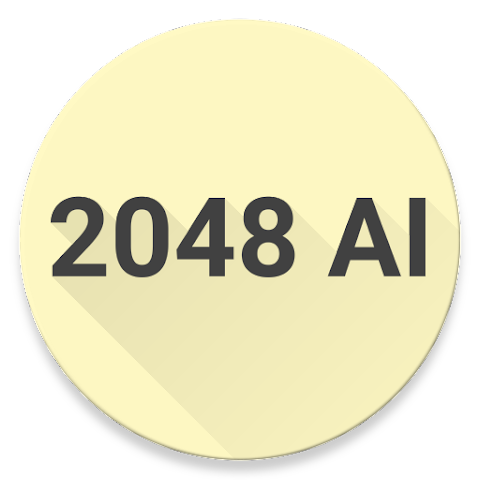

# 🧪 Projects

## Academic Projects

Under construction.

## Personal Projects

Just doing these for fun.

### Handwriting Note 
- 

- This is an Android app that allows you to take handwritten notes. This app was built during the era of [Material Design](https://m3.material.io/). By that time, third party libraries are needed to make the app look *materialized*.
- [Google Play Store](https://play.google.com/store/apps/details?id=com.lyk.immersivenote)
- 10k+ downloads 🔥

### 2048 
- 
- This is an Android 2048 game. It has an AI that can play the game automatically. The AI is based on the Monte Carlo Simulation algorithm. 
- [Google Play Store](https://play.google.com/store/apps/details?id=com.lyk.ai_2048)
